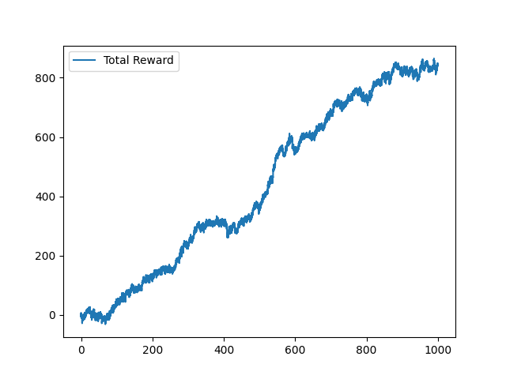
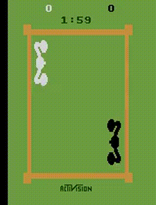

# Q Learning Atari Agent

## Resources

- [Q Learning](https://en.wikipedia.org/wiki/Q-learning)
- [Stable Retro](https://stable-retro.farama.org/)

## Installation

```
    conda install conda-forge::gymnasium-atari
```

## Requirement

[Gymnasium Atari](https://anaconda.org/conda-forge/gymnasium-atari)

## Usage

```python
python ./stable_retro.py
```

## Notes

Optimal Policy Function = pi* = argmax[r(s,a) + gamma * V(s')]

where r(s,a) i sthe immediate reward of taking action a in state s,
V(s') is the value of the next state * gamma, the discount factor.
s' is the next state after taking action a in state s.

Q Function = Q(s,a) = r(s,a) + gamma * V(s') ,_ Same as above but for a single step.

Convergence of Q Learning:

- Q learning is guaranteed to converge to the optimal policy if the following conditions are met:
  - The learning rate is sufficiently small.
  - The exploration strategy ensures that all state-action pairs are visited infinitely often.
  - The state space is finite.
  - The action space is finite.
  - The reward function is bounded.
  - The discount factor is less than 1.
  - The environment is deterministic or the transition probabilities are known.

## Results




## TODO

- [ ] improve telemetry
